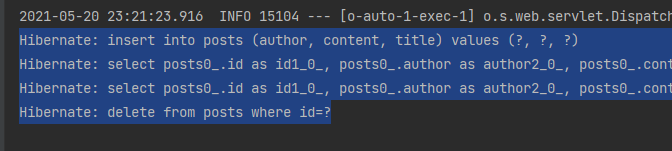

# 3 스프링 부트에서 JPA로 DB 다루기
SQL을 다루는 것을 쉽게 하기위해 나온 JPA   
JPA는 자바 표준 ORM(Object Relational Mapping) 기술
## 3.1 JPA 소개
기존에는 SQL 때문에(?)...   
1. 단순 반복 작업의 문제
2. 패러다임 불일치 문제
	* 관계형 DB는 '어떻게 데이터를 저장' 할지에 초첨
	* 객체지향 프로그래밍 언어는 '기능과 속성을 한 곳에서 관리' 하는 기술
	* 즉, 다른 패러다임으로 인해 객체를 DB에 저장하려고 하니 여러 문제가 발생하고 
	이를 **패러다임 불일치** 라고 함

```java
//객체지향 프로그래밍에서 부모가 되는 객체를 가져오기 위해...
User user = findUser();
Group group = user.getGroup();
//딱 보면 User와 Group이 부모-자식 관계임을 알 수 있음

//그렇다면 여기에 DB가 추가되면...
User user = userDao.findUser();
Group group = groupDao.findGroup(user.getGroupId());
//User 따로, Group 따로 조회
//어떤 관계인지 알 수 없음
```

이렇다 보니 개발은 점점 데이터베이스 모델링에만 집중하게 됨   
이 문제 해결 위해 JPA 등장   
즉, 중간에서 패러다임 일치를 위한 기술

### 요구사항 분석
실습을 위한 요구사항 분석   
이 책의 목표는 앞으로 3장 ~ 6장까지 하나의 게시판 만들어보고 
7장 ~ 10장까지 이 서비스를 AWS에 무중단 배포하는 것 까지 진행
#### 게시판 기능
* 게시글 조회
* 게시글 등록
* 게시글 수정
* 게시글 삭제
#### 회원 기능
* 구글.네이버 로그인
* 로그인한 사용자 글 작성 권한
* 본인 작성 글에 대한 권한 관리

## 3.2 프로젝트에 Spring Data Jpa 적용하기
build.gradle에 아래와 같이 입력해야 JPA 사용 가능
```groovy
implementation 'org.springframework.boot:spring-boot-starter-data-jpa'
runtimeOnly 'com.h2database:h2'
```
### Posts 클래스 만들기
Posts 클래스에는 Setter 메소드가 없음   
이유는 getter/setter를 무작정 생성하게되면 해당 클래스의 인스턴스 값들이 언제 어디서 변해야 하는지
코드상으로 명확하게 구분하기 어려워, 차후 기능 변경시 복잡해지기 때문   

그렇다면 setter가 없는 상태에서 **어떻게 값을 채워 DB에 삽입**해야 하는가?   

기본적인 구조는 **생성자를 통해** 최종 값을 채운 후 DB에 삽입하는 것   
값 변경이 필요한 경우 해당 **이벤트에 맞는 public 메소드를 호출**하여 변경하는 것을 전제로 함

### PostRepository 인터페이스 만들기
PostRepository는 Posts 클래스로 DB를 접근하게 해줄 JpaRepository임

## 3.3 Spring Data JPA 테스트 코드 작성하기
### issue
application.properties에 sql 쿼리 로그 보기 위해서 작성하는게 책이랑 좀 달라서 글 남깁니다.
```groovy
spring.jpa.properties.hibernate.dialect=org.hibernate.dialect.MySQLInnoDBDialect
```
이 코드를 작성하는게 git에서 issue를 검색해보니깐 spring 2.1.x? 이 버전 상위 버전에서는 밑에처럼 
복잡하게 작성해야 한다고 하네요ㅠㅠㅠ   
(저는 설정 다 따라치기 귀찮아서 그냥 spring boot starter로 빠르게 만들어 버렸어요😂)
```groovy
spring.jpa.properties.hibernate.dialect=org.hibernate.dialect.MySQL57Dialect
spring.jpa.properties.hibernate.dialect.storage_engine=innodb
spring.datasource.hikari.jdbc-url=jdbc:h2:mem://localhost/~/testdb;MODE=MYSQL
```

## 3.4 등록/수정/조회 API 만들기
API를 만들기 위해 필요한 클래스
1. Request 데이터를 받은 Dto
2. API 요청을 받을 Controller
3. 트랜잭션, 도메인 기능 간의 순서를 보장하는 Service

### Spring 웹 계층
1. Web Layer
	* 외부 요청과 응답에 대한 전반적인 영역
	
2. Service Layer
	* 일반적으로 Controller와 Dao의 중간 영역에서 사용
	
3. Repository Layer
	* DB와 같이 데이터 저장소에 접근하는 영역
	
4. Dtos
	 * Dto(Data Transfer Object)는 **계층 간에 데이터 교환을 위한 객체**를 말함
	* Dtos는 이들의 영역을 말함
	
5. Domain Model
	* 도메인이라 불리는 개발 대상을 모든 사람이 동일한 관점에서 이해할 수 있고 공유할 수 있도록 단순화시킨 것   
	
### 등록 기능 테스트 결과
   

### 수정 기능 테스트 결과
