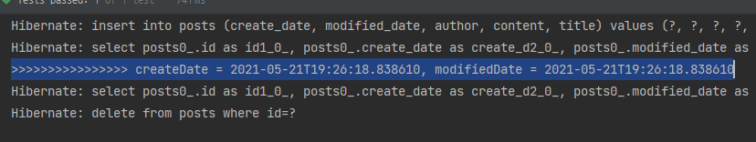

# 3 스프링 부트에서 JPA로 DB 다루기
어제에 이어서 공부
## 3.4 등록/수정/조회 API 만들기
h2 데이터베이스 웹 콘솔 옵션 활성화에 대한 책의 설명이 빈약한 것 같아서 추가 정리
1. application.properties 에 **spring.h2.console.enabled=true** 추가
2. 웹 브라우저에 http://localhost:8080/h2-console 로 검색

이렇게가 기본 설명인데 추가를 하자면 ...   
application.properties 에 밑에와 같이 수정해야 함   
수정한 건 첫 번째 줄에 **jdbc:h2:mem:testdb** 이 부분
```groovy
spring.datasource.hikari.jdbc-url=jdbc:h2:mem:testdb;MODE=MYSQL
spring.h2.console.enabled=true
```
어제 작성할때는 jdbc:h2:mem:localhost/~/ 이런거였는데 이게 git issue에 있는 
남의 코드 그대로 긁어 오다가 문제가 생긴거였다.   
혹시나 문제가 있으면 이렇게 고쳐보고 그래도 문제가 있으면 
https://github.com/jojoldu/freelec-springboot2-webservice/issues 여기 들어가서 검색해서 
확인해 보자  

## 3.5 JPA Auditing으로 생성시간/수정시간 자동화하기
보통 entity에는 해당 데이터의 생성/수정시간(모든 entity에 공통되는 내용이다 이말이야)을 포함   
근데 이 코드가 여기저기 다 들어가면 코드가 지저분해지는데   
위의 문제(공통되는 코드가 많아지는 문제)를 해결하고자 JPA Auditing을 사용함   
JPA Auditing을 더 알고 싶으면 https://webcoding-start.tistory.com/53   
### LocalDate 사용
Java 8 이후 부터의 날짜 타입
### JPA Auditing 테스트 코드
   
생성 시간, 수정 시간을 알 수 있음   
앞으로 추가될 entity들은 더이상 등록/수정일로 고민할 필요 없이   
밑의 BaseTimeEntity만 상속(extends)받으면 자동으로 해결됨
```java
@Getter
@MappedSuperclass //JPA Entity 클래스들이 BaseTimeEntity를 상속할 경우 필드들도 컬럼으로 인식하도록
@EntityListeners(AuditingEntityListener.class) //BaseTimeEntity 클래스에 Auditing 기능을 포함시킴
public class BaseTimeEntity {

    @CreatedDate //생성되어 저장될 떄 시간 자동 저장
    private LocalDateTime createDate;

    @LastModifiedDate //저회한 값 변경할 때 시간이 자동 저장
    private LocalDateTime modifiedDate;
}
```