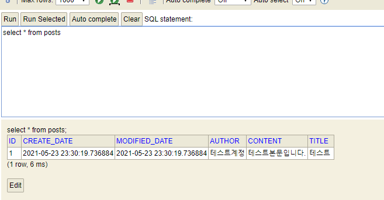

# 4 머스테치로 화면 구성하기
드디어 화면 구성 챕터로 넘어왔다
## 4.1 서버 템플릿 엔진과 머스테치 소개
### 템플릿 엔진?
* 웹 개발에 있어 템플릿 엔진은 **지정된 템플릿 양식과 데이터가 합쳐져** HTML 문서를 출력하는 SW를 말함
	* (JSP, Freemarket), (View 파일) 등을 예시로 들 수 있음   
* > 단, JSP와 Freemarket은 서버 템플릿 엔진(서버에서 구동)이고 View 파일은 클라이언트 템플릿 엔진이라 불림
* 서버 템플릿 엔진을 이용한 화면 생성은   
	* **서버에서 Java 코드로 문자열을** 만든 뒤 이 문자열을 HTML로 변환하여 **브라우저로 전달**   
* SPA는 브라우저에서 화면을 생성(즉, 서버에서 이미 코드가 벗어난 경우)
	* 서버에서는 Json 혹은 Xml 형식의 데이터만 전달하고 클라이언트에서 조립
	
### 머스테치란
머스테치는 (https://mustache.github.io) **수많은 언어를 지원하는 가장 심플한 템플릿 엔진**   
즉 자바에서 사용될 때는 서버 템플릿 엔진으로, 
자바스크립트에서 사용될 때는 클라이언트 템플릿 엔진으로 모두 사용 가능    

**장점**
1. 문법이 다른 템플릿 엔진보다 심플
2. 로직 코드를 사용할 수 없어 View의 역할과 서버의 역할이 명확하게 분리됨
3. Mustache.js와 Mustache.java 2가지가 다 있어, 
   하나의 문법으로 클라이언트/서버 템플릿을 모두 사용 가능
4. 인텔리제이 커뮤니티 버전을 사용해도 플러그인 사용 가능   

### 머스테치 플러그인 설치
1. ctrl + shift + A 눌러서 
2. plugins 검색하고
3. mustache 검색해서
4. install 후
5. 재시작

## 4.2 기본 페이지 만들기
```groovy
//mustache 의존성 등록
implementation 'org.springframework.boot:spring-boot-starter-mustache'
```
index.mustache 만들고 URL을 매핑해야 함   
URL 매칭은 당연하게 Controller에서 진행   
```java
@Controller
public class IndexController {
    @GetMapping("/")
    public String index(){
        return "index"; //머스테치 스타터 덕분에 컨트롤러에서 문자열 반환시 앞의 경로와 확장자는 자동 지정
    }
}
```
문득, 진짜 갑자기, Controller가 뭐였지... 해서 짤게 공부할 수 있는 페이지 공유   
[Controller 설명 페이지](https://hardlearner.tistory.com/315)   

## 4.3 게시글 등록 화면 만들기
3장에서 PostsApiController로 API 구현했기 때문에 바로 화면 구현   
글 등록이 성공하면 메인 페이지로 이동하도록 구현   

부트스트랩과 제이쿼리(머스테치 화면 어디서나 필요) 추가   

index.js의 호출 코드를 보면 절대 경로(/)로 바로 시작하는데 
스프링 부트는 기본적으로 src/main/resources/static에 위치한 js, css, img 등 정적 파일들은 
URL에서 /로 설정됨   

