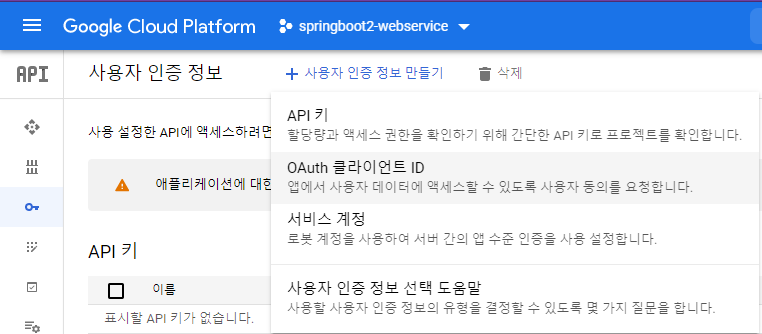

# 5 스프링 시큐리티와 OAuth2.0으로 로그인 기능 구현하기
* 스프링 시큐리티
	* 막강한 인증, 인가 기능을 가진 프레임워크
	* 사실상 스프링 기반의 애플리케이션에서는 보안을 위한 표준
	
* 이번 장에서는 ...
	* 스프링 시큐리티와 OAuth 2.0을 구현한 구글 로그인 연동하여 로그인 기능 만들기
## 5.1 스프링 시큐리티와 스프링 시큐리티 Oauth2 클라이언트
**소셜 로그인 사용 이유?**   
직정 구현할 경우 배보다 배꼽이 커지는 경우 발생
1. 로그인 시 보안
2. 회원가입 시 이메일 혹은 전화번호 인증
3. 비밀번호 찾기/변경
4. 회원정보 변경

OAuth 로그인 구현 시 위 목록의 것들을 모두 
구글, 페이스북, 네이버 등에 맏기면 되니 서비스 개발 집중 가능

### 스프링 부트 1.5 vs 스프링 부트 2.0
연동 방법이 크게 변경되었지만 설정 방법에는 큰 차이가 없는 경우 많음   
**spring-security-oauth2-autoconfigure** 라이브러리 덕분   

하지만 이 책에서는 스프링 부트 2 방식인 Spring Security Oauth2 Client 라이브러리 사용해서 진행   

**이유는** 
* spring-security-oauth2에 더이상 신규 기능 추가 없고 비그 수정 정도의 기능만 추가 예정
  

* 스프링 부트용 라이브러리(starter) 출시
  

* 기존 방식은 확장 포인트가 적절하게 오픈되어 있지 않아 직접 상속, 오버라이딩 필요
* 신규 라이브러리 경우 확장 포인트 고려해서 설계된 상태
  

* 스프링 부트 1.5 방식에서는 url 주소를 모두 명시해야 함
* 스프링 부트 2.0 방식에서는 client 인증 정보만 입력하면 됨
	* 기존에는 직접 입력했던 값들이 2.0으로 오면서 모두 enum으로 대체
	* CommonOAuth2Provider 라는 enum이 새롭게 추가
		* 구글, 깃허브, 페이스북, 옥타의 기본 설정값은 모두 여기서 제공
		* 하지만 **네이버, 카카오는 아직까지는 직접 추가** 필요
	
## 5.2 구글 서비스 등록
1. 구글 서비스에 신규 서비스 생성
2. API 및 서비스 > 대시보드

   
3. 사용자 인증 정보 > 사용자 인증 정보 만들기 > OAuth 클라이언트 ID > 동의 화면 구성
   

   
4. OAuth 동의 화면에서 API 원하는거 검색해서 등록(여기서는 email, profile, openid)

   
5. 다시 OAuth 클라이언트 ID로 돌아와서 사진과 같이 입력 > 생성

   > * 서비스에서 파라미터로 인증 정보를 주었을 때 인증 성공하면 구글에서 리다이렉트할 URL   
   > * 스프링 부트 2 버전의 시큐리티에서는 기본적으로 {도메인}/login/oauth2/code/{소셜서비스코드}로 
   > 리다이렉트 URL 지원   
   > * 개발 단계이므로 **http://localhost:8080/login/oauth2/code/google** 로만 등록   
   > * AWS 서버에 배포 시 localhost 외에 추가로 주소 추가(이후 단계에서 진행)
  
6. 생성 후 나오는 키값들은 따로 알고 있어야 설정시 사용 가능

새롭게 생성된걸 확인 가능
   
7. 프로젝트에 돌아와서 **application-oauth.properties** 생성
```groovy
spring.security.oauth2.client.registration.google.client-id=클라이언트 ID
spring.security.oauth2.client.registration.google.client-secret=클라이언트 보안 비밀
spring.security.oauth2.client.registration.google.scope=profile,email
```
하나의 OAuth2Service로 사용하기 위해 scope에 일부로 openid scope를 빼고 등록
8. spring.profiles.include=oauth를 application.properties에 등록
9. application-oauth.properties는 보안 정보가 있기 때문에 .gitignore에 등록 필수
