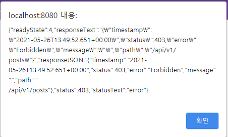
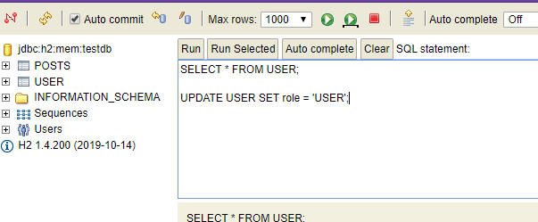
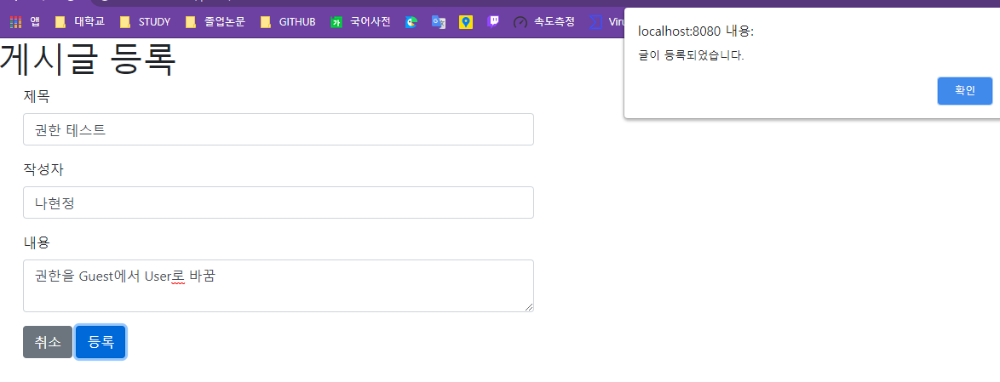

# 5 스프링 시큐리티와 OAuth 2.0으로 로그인 기능 구현하기
오늘 로그인 기능 공부 끝내나...?
## 5.3 구글 로그인 연동하기
구글 로그인 인증 정보를 발급 받았으니 프로젝트 구현 진행   

### User 엔티티 관련 코드 작성
사용자 정보 담당할 도메인 : User    
각 사용자 권한 관리할 Enum 클래스 : Role   
User의 CRUD를 책임 : UserRepository

> **@Builder가 뭔지 갑자기 모르겠어서**   
> * 다수의 필드를 가지는 복잡한 클래스의 경우, 생성자 대신 빌더를 사용하는 경우가 있
> * 장점
>  * 인자가 많을 경우 쉽고 안전하게 객체 생성 가능   
>  * 인자의 순서와 상관없이 객체 생성 가능
>  * 적절한 책임을 이름에 부여하여 가독성 높임

> **빌더 패턴**
>  * 복합 객체의 생성 과정과 표현 방법을 분리하여 동일한 생성 절차에서
	  > 서로 다른 표현 결과를 만들 수 있게 하는 패턴 ([빌더 패턴 위키백과 설명](https://ko.wikipedia.org/wiki/%EB%B9%8C%EB%8D%94_%ED%8C%A8%ED%84%B4))
> * @Builder 어노테이션 사용하면 자동으로 해당 클래스에 빌더 추가

> **@Enumerated(EnumType.STRING)**
> * JPA로 DB 저장 시 Enum 값을 어떤 형태로 저장할지 결정
> * 기본적으로 int 저장
> * 숫자로 저장되면 DB 확인 시 그 값이 무슨 코드 의미하는지 알 수 없음
> * 그래서 User 클래스에서는 문자열로 저장될 수 있도록 선언
> ```java
> @Enumerated(EnumType.STRING)   
> @Column(nullable = false)   
> private Role role;
> ```

> **JpaRepository**   
> * JpaRepository는 인터페이스이다.    
> * 인터페이스에 미리 검색 메소드를 정의 해 두는 것으로, 
> 메소드를 호출하는 것만으로 스마트한 데이터 검색을 할 수 있게 되는 것이다.

### 스프링 시큐리티 설정
1. build.gradle에 스프링 시큐리티 관련 의존성 추가   
   (클라이언트 입장에서 소셜 기능 구현 시 필요한 의존성)
```groovy
//스프링 시큐리티
implementation 'org.springframework.boot:spring-boot-starter-oauth2-client'
```
2. 시큐리티 관련 클래스 저장할 패키지 config.auth
	* SecurityConfig.java, CustomOAuth2UserService.java 생성
	
3. 이 책에서 OAuthAttributes는 Dto로 봄 
	* config.auth.dto 패키지 만듬
	
4. 세션에서 사용자 정보를 저장하기 위해 SessionUser 라는 새로운 Dto 클래스 생성

> 왜 사용자 정보를 다루는데 기존에 있던 User 클래스를 쓰지 않고 새로 만드는걸까?

User 클래스를 세션에 저장하려고 하면 User 클래스에 **직렬화를 구현하지 않았다**는 
의미의 에러 발생   

> 그러면 User 클래스에 직렬화 구현?

답은 NO   
왜냐하면 User 클래스가 엔티티이기 때문   

엔티티 클래스는 언제 다른 엔티티와 관계가 형성될지 모름   
그렇기 때문에 User 클래스에 직렬화를 구현하면 
직렬화 대상에 해당 자식들까지 포함되어 문제 발생 가능성 생김   

그러므로 직렬화 기능을 가진 세션 Dto를 하나 추가로 만드는 것이 이후 운영/유지보수에 도움이 됨

### 로그인 테스트
   
처음에는 GUEST라 글 작성 권한이 없기 때문에 403 에러 발생   
sql문으로 권한을 USER 로 바꾼 후 로그아웃 후 
다시 로그인해서 글을 작성하면 정상적으로 등록되는 것을 알 수 있음  

   

## 5.4 어노테이션 기반으로 개선하기
앞서 만든 코드에서 개선할만한 것은 IndexController에서 세션값을 가져오는 부분
```java
SessionUser user = (SessionUser) httpSession.getAttribute("user");
```
index 메소드 외에 다른 컨트롤러와 메소드에서 세션값이 필요하면 그 때마다 직접 가져와야 하는 복잡함   
이 부분을 **메소드 인자로 세션값을 바로 받을 수 있도록** 변경 필요

1. config.auth 패키지에 **@LoginUser 어노테이션** 생성   
2. 같은 위치에 **LoginUserArgumentResolver**
(HandlerMethodArgumentResolver 인터페이스를 구현한 클래스) 생성   
	* HandlerMethodArgumentResolver는 조건에 맞는 경우 메소드가 있다면 
	  HandlerMethodArgumentResolver의 구현체가 지정한 값으로 해당 메소드의 파라미터로 넘길 수 있음   
3. LoginUserArgumentResolver가 인식될 수 있도록 WebMvcConfigurer에 추가
	* config 패키지에 **WebConfig 클래스** 생성
	
```java
/**
 * 메인 페이지와 관련된 컨트롤러
 */
@RequiredArgsConstructor
@Controller
public class IndexController {
    
    private final PostsService postsService;
    private final HttpSession httpSession;

    @GetMapping("/")
    public String index(Model model, @LoginUser SessionUser user){
        //기존에 가져오던 세션 정보 값이 개선되었음
        //이제는 어느 컨트롤러든지 @LoginUser만 사용하면 세션 정보 가져올 수 있음
        
        model.addAttribute("posts", postsService.findAllDesc());

        //userName을 사용할 수 있게 userName을 model에 저장하는 코드 추가
        //로그인 성공 시 세션에 SessionUser를 저장하도록 구성
        //SessionUser user = (SessionUser) httpSession.getAttribute("user"); //로그인 성공시 값 가져올 수 있음

        if(user != null){
            //세션에 저장된 값이 있을 때만 model에 userName으로 등록
            //세션에 저장된 값이 없으면 model엔 아무런 값이 없는 상태이니 로그인 버튼이 보이게됨
            model.addAttribute("userName", user.getName());
        }

        return "index";//머스테치 스타터 덕분에 컨트롤러에서 문자열 반환시 앞의 경로와 확장자는 자동 지정
    }
}
```

코드를 수정하여도 멀쩡히 잘 동작하는걸 확인할 수 있었음   

---
어... 오늘 공부 다 끝내려고 했는데 컨티션이 이상하고, 시간도 없어서 
내일 세션 저장, 네이버 로그인 기능 추가 등을 이어서 해야지...😥