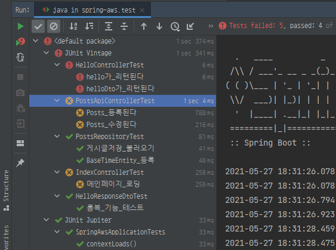
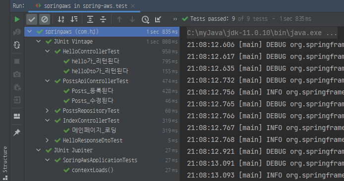

# 5 스프링 시큐리티와 OAuth 2.0으로 로그인 기능 구현하기

## 5.5 세션 저장소로 데이터베이스 사용하기
### 지금까지의 문제
현재까지 서비스는 **애플리케이션을 재실행하면 로그인이 풀림**   
이유는 세션이 내장 톰캣의 메모리에 저장되기 때문   

기본적으로 세션은 실행되는 WAS(Web Application Server)의 메모리에서 저장되고 호출됨   

메모리에 저장되다 보니 내장 톰캣처럼 애플리케이션 실행 시 실행되는 구조에선 항상 초기화됨   
즉, 배포할 때마다 톰캣 재시작

또 다른 문제는 **2대 이상의 서버에서 서비스하고 있다면 톰캣마다 세션 동기화 설정이 필요함**   

### 위의 문제점을 해결하기 위해서 현업에서는 ...
1. 톰캣 세션 사용   
   1. 기본 선택 방식
	2. WAS에 세션이 저장되기 때문에 2대 이상의 WAS가 구동되는 환경에서는 
	   세션 공유 위해 추가 설정 필요
2. MySQL과 같은 DB를 세션 저장소로 사용
   1. WAS간 공용 세션 사용할 수 있는 가장 쉬운 방법
	2. 로그인 요청마다 DB IO가 발생하여 성능상 이슈 발생 가능성 있음
	3. 보통 로그인 요청이 많이 없는 시스템 용도에서 사용
3. Redis, Memcached와 같은 메모리 DB를 세션 저장소로 사용
	1. B2C 서비스에서 가장 많이 사용하는 방식
	2. 외부 메모리 서버가 필요
	
사용자가 없는 현재 단계에서는 DB로 모든 기능을 처리하는게 부담이 적음

### spring-session-jdbc 등록
1. build.gradle에 아래와 같이 의존성 추가
```groovy
implementation 'org.springframework.session:spring-session-jdbc'
```
2. application.properties에 세션 저장소를 jdbc로 선택하도록 코드 추가
```properties
spring.session.store-type=jdbc
```
3. 다시 애플리케이션 실행, 로그인 테스트, h2-console로 접속   
2개의 테이블(SPRING_SESSION, SPRING_SESSION_ATTRIBUTES)이 생성된걸 알 수 있음   
   
   
세션 저장소를 DB로 교체했음   
그러나 지금은 스프링을 재시작하면 세션이 풀림   
왜냐하면 H2 기반으로 스프링이 재실행될 때 H2도 재시작되기 때문   
나중에 AWS로 배포하게 되면 AWS의 DB 서비스인 RDS를 사용하게 되면 
이때부터는 세션이 풀리지 않음

## 5.6 네이버 로그인
### 네이버 API 등록
[네이버 오픈 API](https://developers.naver.com/apps/#/register?api=nvlogin) 로 이동해서 
아래 사진과 같이 입력
   
   

### 키 값 수동 등록
application-oauth.properties에 아래와 같이 다... 입력   
네이버는 스프링 시큐리티를 따로 지원하지 않기 때문에 구글 입력때에 비해 작성할 내용이 많음 
```properties
# naver registration
spring.security.oauth2.client.registration.naver.client-id=클라이언트id
spring.security.oauth2.client.registration.naver.client-secret=클라이언트secret
spring.security.oauth2.client.registration.naver.redirect-uri={baseUrl}/{action}/oauth2/code/{registrationId}
spring.security.oauth2.client.registration.naver.authorization_grant_type=authorization_code
spring.security.oauth2.client.registration.naver.scope=name,email,profile_image
spring.security.oauth2.client.registration.naver.client-name=Naver

# naver provider
spring.security.oauth2.client.provider.naver.authorization_uri=https://nid.naver.com/oauth2.0/authorize
spring.security.oauth2.client.provider.naver.token_uri=https://nid.naver.com/oauth2.0/token
spring.security.oauth2.client.provider.naver.user-info-uri=https://openapi.naver.com/v1/nid/me
spring.security.oauth2.client.provider.naver.user_name_attribute=response
```

### 스프링 시큐리티 설정 등록
구글 로그인 등록하면서 대부분 코드가 확장성 있게 작성되었음   
네이버는 쉽게 등록 가능

OAuthAttributes.java에 네이버인지 판단하는 코드와 네이버 생성자만 추가해주면 끝
```java
public class OAuthAttributes {
    public static OAuthAttributes of(String registrationId, String userNameAttributeName, Map<String, Object> attributes){
        //naver 로그인 여부 추가됨
        if("naver".equals(registrationId)){
            return ofNaver("id", attributes);    
        }
        return ofGoogle(userNameAttributeName, attributes);
    }
    //네이버 생성자
    private static OAuthAttributes ofNaver(String userNameAttributeName, Map<String, Object> attributes){
        Map<String, Object> response = (Map<String, Object>) attributes.get("response");
        return OAuthAttributes.builder()
                .name((String)response.get("name"))
                .email((String)response.get("email"))
                .picture((String)response.get("profile_image"))
                .attributes(response)
                .nameAttributeKey(userNameAttributeName)
                .build(); 
    }

}
```
정상적으로 네이버 로그인 화면 뜨고 메인 화면에서도 정상적으로 정보 가져오면 성공

## 5.7 기존 테스트에 시큐리티 적용하기
기존 테스트에 시큐리티 적용으로 문제가 되는 부분 있음   
> 기존에는 바로 API를 호출할 수 있었지만 시큐리티 옵션이 활성화 되면서 인증된 사용자만
> API를 호출 할 수 있게 됨.   
> 
> 기존 API 테스트 코드들이 모두 인증에 대한 권한을 받지 못했기 때문에, 
> 테스트 코드마다 인증한 사용자가 호출한 것처럼 작동하도록 수정 필요

우선 전체 테스트를 수행해 본다.   

   
롬복을 이용한 테스트 외에는 모두 실패하는걸 볼 수 있음(SpringAwsApplicationTest 제외)   
### 문제의 이유
1. CustomOAuth2UserService을 찾을 수 없음   
우선 "hello가_리턴된다"의 메시지를 보면...
```text
No qualifying bean of type 'com.hj.springaws.config.auth.CustomOAuth2UserService' 
available: expected at least 1 bean which qualifies as autowire candidate. 
Dependency annotations: {}
```
* CustomOAuth2UserService를 생성하는데 필요한 **소셜 로그인 관련 설정값들이 없기 때문에** 발생
* 왜?
	* src/main 환경과 src/test 환경의 차이 때문
	* 자동으로 test 환경에 가져오는 properties 파일은 application.properties 까지만임
	* application-oauth.properties는 가져오는 파일이 아님
	
* 즉, 테스트 환경 위한 application.properties를 만들고 가짜 설정값 등록
2. 302 Status Code   
"Posts_등록된다" 테스트 로그를 보면...
```text
org.opentest4j.AssertionFailedError: 
Expecting:
 <302 FOUND>
to be equal to:
 <200 OK>
but was not.
Expected :200 OK
Actual   :302 FOUND
<Click to see difference>
```
* 스프링 시큐리티 설정 때문에 인증되지 않은 사용자의 요청은 이동시키기 때문에 발생
* 이런 API 요청은 임의로 인증된 사용자를 추가하여 API만 테스트해 볼 수 있도록 하자
* build.gradle에 아래 코드 추가
```groovy
//스프링 시큐리티 테스트 도구 지원
testImplementation 'org.springframework.security:spring-security-test'
```
* 해당되는 파일의 테스트들에게 **@WithMockUser(roles = "USER")** 를 추가해주자
	* 인증된 가짜 사용자를 만들어서 사용함
	* 이것만 추가해서는 동작하지 않음
		* @WithMockUser가 MockMvc에서만 작동하기 때문
	* @SpringBootTest에서 MockMvc를 사용할 수 있도록 해줘야 함
	
3. @WebMvcTest에서 CustomOAuth2UserService를 찾을 수 없음   
1번 문제와 같은 오류 발생... 왜?
   
* HelloControllerTest는 **@WebMvcTest를 사용한다는** 점에서 1번의 오류와는 좀 다름
* 1번을 통해 스프링 시큐리티 설정은 잘 동작했지만 @WebMvcTest는 CustomOAuth2UserService를 
스캔하지 않기 때문
  
* @WebMvcTest에서 @Repository, @Service, @Component는 스캔 대상이 아님
* SecurityConfig 파일은 읽었지만, SecurityConfig를 생성하기 위해 필요한 CustomOAuth2UserService를 
  읽을 수 없어서 에러 발생
* 그러므로 다음 코드를 추가해 스캔 대상에서 SecurityConfig를 제거
```java
@RunWith(SpringRunner.class)
@WebMvcTest(controllers = HelloController.class, excludeFilters = {
        @ComponentScan.Filter(type = FilterType.ASSIGNABLE_TYPE, classes = SecurityConfig.class)
})//추가
public class HelloControllerTest {

    @Autowired
    private MockMvc mvc;

    @WithMockUser(roles = "USER") //추가
    @Test
    public void hello가_리턴된다() throws Exception {
        String hello = "hello";

        mvc.perform(get("/hello"))
                .andExpect(status().isOk())
                .andExpect(content().string(hello));
    }

    @WithMockUser(roles = "USER") //추가
    @Test
    public void helloDto가_리턴된다() throws Exception{
        String name = "hello";
        int amount = 1999;

        mvc.perform(get("/hello/dto").param("name", name).param("amount", String.valueOf(amount)))
                .andExpect(status().isOk())
                .andExpect(jsonPath("$.name", is(name)))
                .andExpect(jsonPath("$.amount", is(amount)));
    }

}
```
* 이렇게 해도 추가 에러 발생
```text
At least one JPA metamodel must be present!
```
* 이 에러는 @EnableJpaAuditing으로 인해 발생
* EnableJpaAuditing을 사용하기 위해선 최소 하나의 @Entity 클래스가 필요하지만 @WebMvTest에는 
당연히 없음
  
* @EnableJpaAuditing 과 @SpringBootApplication 이 함께 있다 보니
@WebMvcTest에서도 스캔하게 되었음
* 둘을 분리해야 함
```java
/**
 * @EnableJpaAuditing과 @SpringBootApplication을 분리하기 위해
 * 클래스를 따로 만들었다
 * @WebMvcTest는 일반적인 @Configuration은 스캔하지 않음
 */
@Configuration
@EnableJpaAuditing //JPA Auditing 활성화
public class JpaConfig {
}
```
최종적으로 모든 테스트가 통과하는걸 확인할 수 있음   

