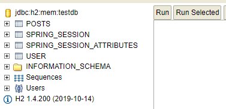
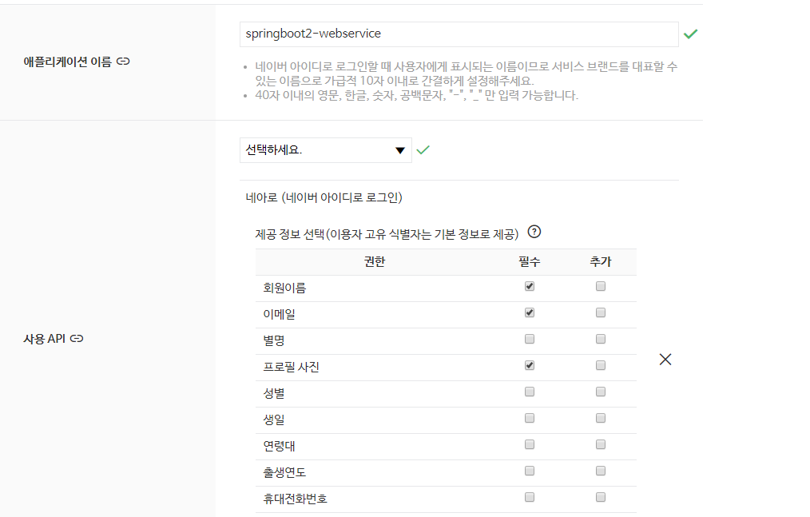
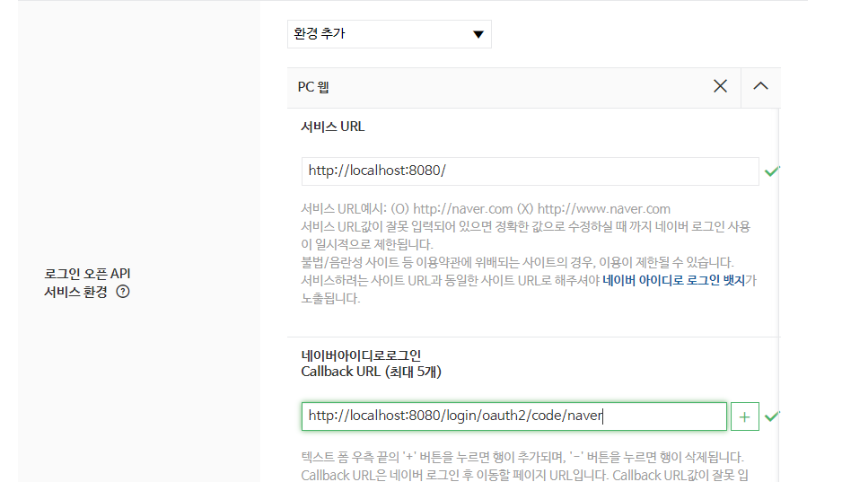

# 5 스프링 시큐리티와 OAuth 2.0으로 로그인 기능 구현하기

## 5.5 세션 저장소로 데이터베이스 사용하기
### 지금까지의 문제
현재까지 서비스는 **애플리케이션을 재실행하면 로그인이 풀림**   
이유는 세션이 내장 톰캣의 메모리에 저장되기 때문   

기본적으로 세션은 실행되는 WAS(Web Application Server)의 메모리에서 저장되고 호출됨   

메모리에 저장되다 보니 내장 톰캣처럼 애플리케이션 실행 시 실행되는 구조에선 항상 초기화됨   
즉, 배포할 때마다 톰캣 재시작

또 다른 문제는 **2대 이상의 서버에서 서비스하고 있다면 톰캣마다 세션 동기화 설정이 필요함**   

### 위의 문제점을 해결하기 위해서 현업에서는 ...
1. 톰캣 세션 사용   
   1. 기본 선택 방식
	2. WAS에 세션이 저장되기 때문에 2대 이상의 WAS가 구동되는 환경에서는 
	   세션 공유 위해 추가 설정 필요
2. MySQL과 같은 DB를 세션 저장소로 사용
   1. WAS간 공용 세션 사용할 수 있는 가장 쉬운 방법
	2. 로그인 요청마다 DB IO가 발생하여 성능상 이슈 발생 가능성 있음
	3. 보통 로그인 요청이 많이 없는 시스템 용도에서 사용
3. Redis, Memcached와 같은 메모리 DB를 세션 저장소로 사용
	1. B2C 서비스에서 가장 많이 사용하는 방식
	2. 외부 메모리 서버가 필요
	
사용자가 없는 현재 단계에서는 DB로 모든 기능을 처리하는게 부담이 적음

### spring-session-jdbc 등록
1. build.gradle에 아래와 같이 의존성 추가
```groovy
implementation 'org.springframework.session:spring-session-jdbc'
```
2. application.properties에 세션 저장소를 jdbc로 선택하도록 코드 추가
```properties
spring.session.store-type=jdbc
```
3. 다시 애플리케이션 실행, 로그인 테스트, h2-console로 접속   
2개의 테이블(SPRING_SESSION, SPRING_SESSION_ATTRIBUTES)이 생성된걸 알 수 있음   
   
   
세션 저장소를 DB로 교체했음   
그러나 지금은 스프링을 재시작하면 세션이 풀림   
왜냐하면 H2 기반으로 스프링이 재실행될 때 H2도 재시작되기 때문   
나중에 AWS로 배포하게 되면 AWS의 DB 서비스인 RDS를 사용하게 되면 
이때부터는 세션이 풀리지 않음

## 5.6 네이버 로그인
### 네이버 API 등록
[네이버 오픈 API](https://developers.naver.com/apps/#/register?api=nvlogin) 로 이동해서 
아래 사진과 같이 입력
   
   

### 키 값 수동 등록
application-oauth.properties에 아래와 같이 다... 입력   
네이버는 스프링 시큐리티를 따로 지원하지 않기 때문에 구글 입력때에 비해 작성할 내용이 많음 
```properties
# naver registration
spring.security.oauth2.client.registration.naver.client-id=클라이언트id
spring.security.oauth2.client.registration.naver.client-secret=클라이언트secret
spring.security.oauth2.client.registration.naver.redirect-uri={baseUrl}/{action}/oauth2/code/{registrationId}
spring.security.oauth2.client.registration.naver.authorization_grant_type=authorization_code
spring.security.oauth2.client.registration.naver.scope=name,email,profile_image
spring.security.oauth2.client.registration.naver.client-name=Naver

# naver provider
spring.security.oauth2.client.provider.naver.authorization_uri=https://nid.naver.com/oauth2.0/authorize
spring.security.oauth2.client.provider.naver.token_uri=https://nid.naver.com/oauth2.0/token
spring.security.oauth2.client.provider.naver.user-info-uri=https://openapi.naver.com/v1/nid/me
spring.security.oauth2.client.provider.naver.user_name_attribute=response
```

### 스프링 시큐리티 설정 등록
구글 로그인 등록하면서 대부분 코드가 확장성 있게 작성되었음   
네이버는 쉽게 등록 가능

OAuthAttributes.java에 네이버인지 판단하는 코드와 네이버 생성자만 추가해주면 끝
```java
public class OAuthAttributes {
    public static OAuthAttributes of(String registrationId, String userNameAttributeName, Map<String, Object> attributes){
        //naver 로그인 여부 추가됨
        if("naver".equals(registrationId)){
            return ofNaver("id", attributes);    
        }
        return ofGoogle(userNameAttributeName, attributes);
    }
    //네이버 생성자
    private static OAuthAttributes ofNaver(String userNameAttributeName, Map<String, Object> attributes){
        Map<String, Object> response = (Map<String, Object>) attributes.get("response");
        return OAuthAttributes.builder()
                .name((String)response.get("name"))
                .email((String)response.get("email"))
                .picture((String)response.get("profile_image"))
                .attributes(response)
                .nameAttributeKey(userNameAttributeName)
                .build(); 
    }

}
```
정상적으로 네이버 로그인 화면 뜨고 메인 화면에서도 정상적으로 정보 갖져오면 성공

## 5.7 기존 테스트에 시큐리티 적용하기 