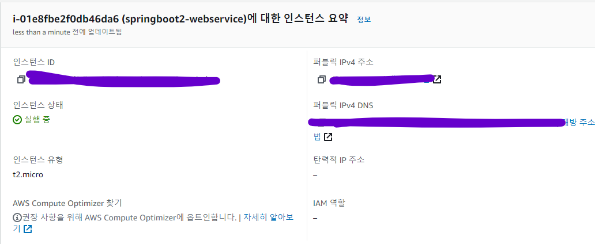
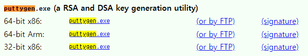

# 6 AWS 서버 환경을 만들어보자 - AWS EC2
> **24시간 작동하는 서버의 3가지 선택지**
1. 집에 PC를 24시간 구동시킴
2. 호스팅 서비스(Cafe 24, 코리아호스팅 등)을 이용
3. 클라우드 서비스(AWS, AZURE, GCP 등)을 이용

특정 시간에만 트래픽이 몰린다면 유동적으로 사양을 늘릴 수 있는 클라우드가 유리   

> **클라우드의 형태 몇 가지**
1. IaaS(Infrastructure as a Service)
   * 기존 물리 장비를 미들웨어와 함께 묶어둔 추상화 서비스
	* IT 인프라를 대여해주는 서비스
	* AWS의 EC2, S3 등
2. PaaS(Platform)
   * Iaas에서 한 번 더 추상화한 서비스
	* 많은 기능이 자동화 되어있음
	* AWS의 Beanstalk, Heroku 등
3. SaaS(Software)
	* SW 서비스를 말함
	* 구글 드라이브, 드랍박스, 와탭 등
	
> **이 책에서 AWS를 선택한 이유**
1. 첫 가입 시 1년간 대부분 서비스가 무료
2. 클라우드에서는 기본적으로 지원하는 기능(모니터링, 로그관리, 백업, 복구, 클러스터링 등)이 많아 
   개인, 소규모일 때 개발에 좀 더 집중 가능
   
3. 많은 기업에 AWS로 이전 중이기 때문에 이직 때 AWS 사용 경험은 도움이 됨
4. 사용자가 많아 국내 자료, 커뮤니티 활성화

> 이 책에서 진행하는 모든 AWS 서비스는 IaaS를 사용
* AWS의 서비스인 빈스톡을 사용하면 대부분 작업이 간소화되지만, 프리티어로 무중단 배포 불가능
  (돈을 내고 2대 사용하면 가능)

## 6.1 AWS 회원 가입
[AWS 공식 사이트](https://aws.amazon.com/ko/)   


* Master 혹은 Visa 카드 필요   
* 들어가서 순서대로 진행하면 됨   
* 영문 주소 필요하면 본인 주소를 네이버에 검색하면 나옴   

## 6.2 EC2 인스턴스 생성하기
EC2(Elastic Compute Cloud)는 AWS에서 제공하는 성능, 용량 등을 유동적으로 사용할 수 있는 서버   
보통 "AWS에서 리눅스 서버 혹은 윈도우 서버를 사용합니다." 라고 하면 
이 EC2를 이야기 하는 것

> 프리티어 플랜에서 EC2 사용 제한
1. 사양이 t2.micro만 가능
   * vCPU(가상 CPU) 1 Core, 메모리 1GB 사양임
	* 보통 vCPU는 물리 CPU 사양의 절반 정도의 성능을 가짐
2. 월 750시간의 제한이 있음. 초과하면 비용 부과
	* 24시간 * 31일 = 744시간
	* 즉, 1대의 t2.micro만 사용한다면 24시간 사용할 수 있음

> 인스턴스란 EC2 서비스에 생성된 가상머신을 말함

[프리티어 관련해서 궁금한 점](https://mwoo526.tistory.com/20) 은 여기 가면 해지 방법 등도 알려줌

### 인스턴스 생성 단계
1. AMI(Amazon Machine Image)를 선택   
여기서 Amazon Linux 2를 선택
   ([책에는 1로 선택하라는데 지원 종료](https://github.com/jojoldu/freelec-springboot2-webservice/issues/620))
	> **AMI란?**   
	> * EC2 인스턴스를 시작하는 데 필요한 정보를 이미지로 만들어 둔 것
	> * 인스턴스라는 가상 머신에 운영체제 등을 설지할 수 있게 만들어둔 이미지로 생각

2. 인스턴스 유형에서 기본적으로 선택되어있는 t2.micro 확인하고 
   **다음:인스턴스 세부 정보 구성** 선택
   > t2 : 요금 타입을 의미
   > micro : 사양을 의미
   
3. 세부 정보 구성   
	* 기업에서 사용할 경우 세세하게 다루지만 혼자서 1대의 서버만 사용하기 때문에
	별다른 설정 없이 넘어감
	  
4. 스토리지 선택   
기본 8GB인데 프리티어는 최대 30GB까지 가능하다고 함   
   
   
5. 태그 추가   
태그에는 웹 콘솔에서 표기될 태그인 Name 태그를 등록   
   태그는 해당 인스턴스를 표현하는 여러 이름으로 사용 가능   
   EC2의 이름을 붙인다고 생각
   
   
6. 보안 그룹 추가   
보안 그룹은 방화벽을 의미
   
7. 인스턴스 시작 검토   
현재 프로젝트의 기본 포트인 8080은 전체 오픈이 되어서 경고 메시지 뜨는데 
   그냥 시작하기 버튼 누르면 됨   
   인스턴스는 pem 키(비밀키)와 매칭되는 공개키를 가지고 있어서, 
   해당 pem 키 외에는 접근을 허용하지 않음   
   새 키 페어 생성해서 키 페이 이름 지정하고 다운로드 하기
   
### 인스턴스 생성 완료
   
   
생성은 완료했지만 또 고려해야할 것이 있음   
인스턴스도 결국 하나의 서버이기 때문에 IP가 존재하고 
인스턴스 중지하고 다시 시작하면 새 IP가 할당됨   
요금 아끼려고 인스턴스 중지 후 다시 시작하면 IP가 변경되는 형상 발생   
고정 IP를 가지게 해야함
### 고정 IP(Elastic IP) 할당
왼쪽에서 **네트워크 및 보안 > 탄력적 IP** 로 가서 새로 할당   
그 후 **작업 > 탄력적 IP 주소 연결** 클릭 (안에 내용 그대로 다 클릭하면 연결 끝)   
마지막으로 인스턴스로 가면 탄력적 IP를 할당받은 걸 알 수 있음
> **주의사항**   
> 탄력적 IP를 생성하고 바로 EC2 서버에 연결하지 않으면 비용 발생함   
> 즉, 탄력적 IP 생성하고 바로 연결해야 한다.

## 6.3 EC2 서버에 접속하기
Windows 기준으로 작성   

윈도우에서는 ssh 접속하기에 불편한 점이 많아 별도의 클라이언트 **"putty"** 설치 필요   
밑의 두 가지만 따로 설치   
   
   

puttygen.exe 를 실행해서 conversions > import key 해서 아까 따로 다운 받았던 pem 을 등록 후 
save pricate key 함. (경고 메시지는 예 클릭 후 넘어가기)   

putty.exe 실행해서 Host Name에 ec2-user@본인의탄력적IP 넣기   
그 후 connection > SSH > Auth로 가서 ppk 파일을 로드할 수 있는 화면으로 이동 후 Browse 해서 
아까 저장했던 pem을 등록   
다시 Session으로 이동해서 Saved Sessions에 현재 설정들을 저장할 이름 등록 후 save   
해당 이름 클릭 후 open   


## 6.4 아마존 리눅스 2 서버 생성 시 꼭 해야 할 설정 들
위에서 아마존 리눅스 1 지원이 중단되어서 2를 써야한다는 이슈를 공유했었다.   
차이점이라고는 자바의 설치 여부라고 한다(1에는 자바 7 설치, 2에는 아예 미설치)   
(해보니깐 그냥 리눅스 설정하는겨...)   

> 해야할 일
1. Java 8 설치 (현재 프로젝트 버전이 Java 8이기 때문)
2. 타임존 변경 (기본 서버 시간대는 미국, 그러나 우리는 한국)
3. 호스트네임 변경 (현재 접속한 서버의 별명을 등록, IP 만으로 서버 역할 모르기 때문에 필수)

### Java 8 설치
```text
<Java 1.8 설치 - 처음 Java 설치하게 되는거, 버전 2는 Java 미설치 상태>
sudo yum install -y java-1.8.0-openjdk-devel.x86_64
```
```text
<인스턴스의 Java 버전을 8로 변경>
sudo /usr/sbin/alternatives --config java
<그냥 나온거 선택하고(1) 끝> 
```
```text
<Java 버전 확인>
java -version
```
   
### 타임존 변경
EC2 서버의 기본 타임존은 UTC   
한국 시간과 9시간 차이가 발생하기 때문에 꼭 수정해야함
```text
<순서대로 입력하기>
sudo rm /etc/localtime
sudo ln -s /usr/share/zoneinfo/Asia/Seoul /etc/localtime
date
```

### 호스트네임 변경
여러 서버 관리 중일 경우 IP 만으로 어떤 서비스의 서버인지 확인이 어려움   
   
이렇식이면 뭐가 뭔지 모름...   
```text
sudo vim /etc/sysconfig/network
```
   
이렇게 2줄만 뜨는걸 볼 수 있음... 여기에다가 아래 내용 추가
```text
HOSTSNAME=내가원하는이름
```
> vim 파일 사용하는 법
> * 들어간 파일에서 **_i_** 입력하면 내용 수정 가능
> * 입력이 끝나면 **_esc_** 를 누르고
> * **_:wq_** 를 입력하면 저장하고 파일 나감
> * 그냥 확인만 하고 나가고 싶으면 **_:q_** 를 입력해도 됨
>
그 후 **재부팅** --- 근데 이거 계속 오류남. 심지어 다른 사람들도 해결 못한듯   

Hostname 등록 했으면 한 가지 작업을 더 해야함   
호스트 주소 찾을 때 가장 먼저 검색해 보는 /etc/hosts/에 변경한 hostname을 등록해야함   
```text
sudo vim /etc/hosts
<아래 내용 등록>
127.0.0.1 등록한HOSTNAME
```
그 후에   
```text
curl 등록한 호스트 이름
```
   
이런식으로 뜨면 등록 성공임   
그렇지만 변경 실패임... ㅂㄷㅂㄷ 도대체 왜 이러는지... 알수도 없고... 그냥 살아야지...ㅎㅎㅎ   
재부팅을 AWS에서 직접 해봤는데도... 성공 못함... 진짜... 화가난다!